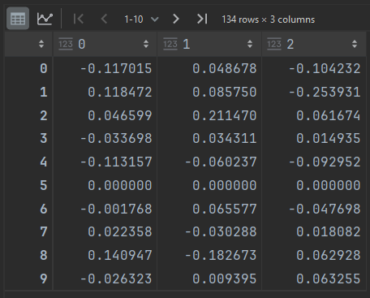
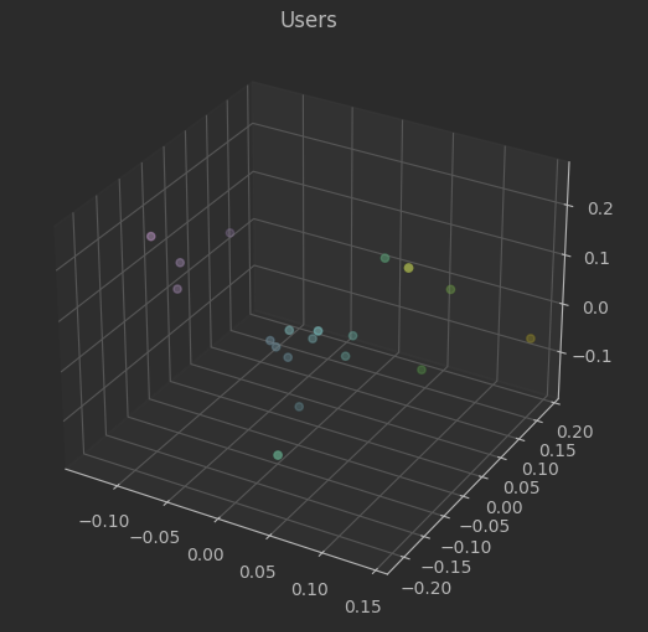
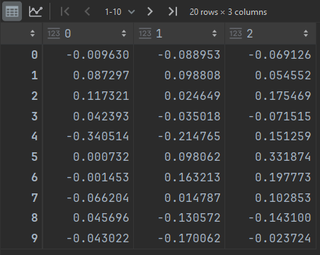
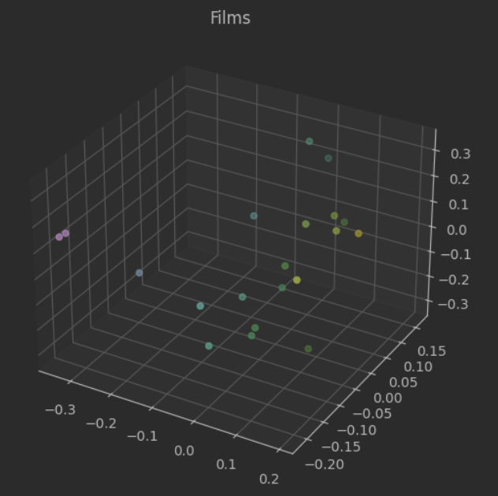
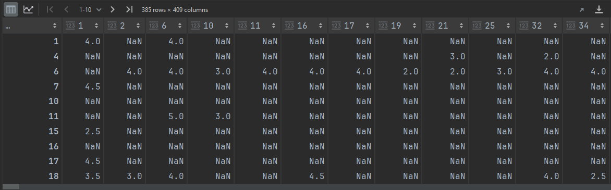
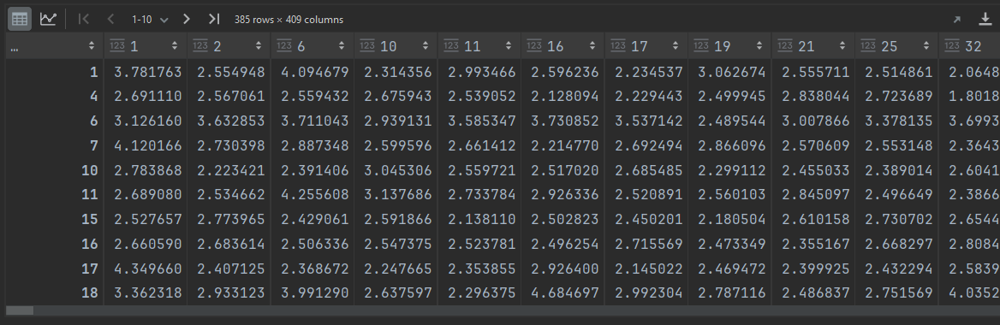
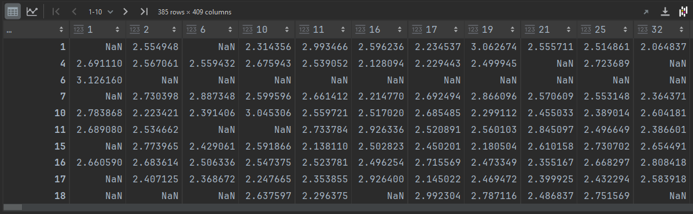
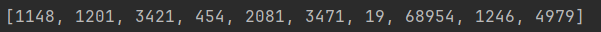
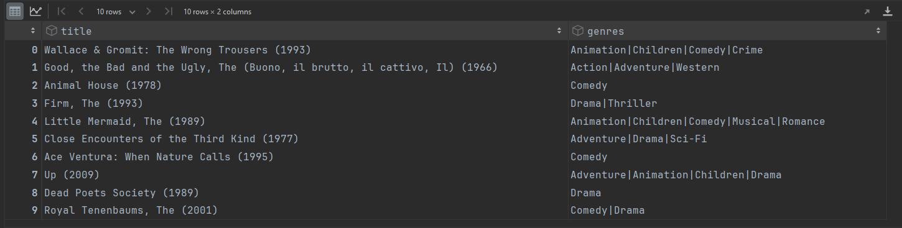

# Applied-Linear-Algebra-KSE-lab_3
**Перед початком виконання роботи:**

- Рекомендовано використовувати Python та Jupyter Notebook
- В описі до кожного завдання вказується набір рекомендованих бібліотек та корисні посилання
- Оцінювання:
1. Завдання 1 **1 б**.
2. Завдання 2 Частина 1 **2 б**
3. Завдання 2 Частина 2 **3 б**.
4. Захист лабораторної роботи **4 б.**
5. Теоретичні питання **2 б.**

----------------------------

### Завдання 1: Реалізація SVD (1 б.).

***Опис:*** Напишіть функцію, яка приймає довільну матрицю і повертає три матриці **U**, **$\Sigma$**, **$V^T$**, використовуючи бібліотеку NumPy (окрім вже готових функцій, таких як np.linalg.svd тощо). Також здійсніть перевірку розкладу, перемноживши відповідні матриці, та порівнявши з початковою матрицею. Дуже рекомендую переглянути [це відео](https://youtu.be/vSczTbgc8Rc?si=NX8eTqH1KsUmJnZj) перед початком виконання всієї лабораторної роботи. Також можна глянути наступне коротке [відео](https://youtu.be/mBcLRGuAFUk?si=nxhLO82Zn8-PKRHJ), що покриє всю необхідну теорію для виконання першого завдання.

***Підказка:*** Не забувайте, що ліві та праві сингулярні вектори мають бути не довільними власними векторами відповідних матриць, а узгодженими за формулою $\sigma * u_i = A * v_i$, де $u_i$ та $v_i$ - ліві та праві сингулярні вектори відповідно. Успіхів з лабою)

----------------------------

### Завдання 2 Частина 1: Алгоритм рекомендацій, Візуалізація даних (2 б.)
***Опис:*** Реалізувати алгоритм зменшення розмірності даних, для подальшої візуалізації цих даних, та аналізу зв'язків між цими даними. 

***Мета роботи:*** Встановити користувачів зі схожими вподобаннями у фільмах, встановити які фільми між собою схожі на основі вподобань користувачів

**Рекомендовані бібліотеки:** NumPy, SciPy, Pandas, MatPlotLib

**Корисні посилання:** [Теорія стосовно SVD та ідея алгоритму](https://jaketae.github.io/study/svd/) 

#### Порядок виконання роботи:
1. Завантажити набір даних MovieLens, що прикріплений до репозиторію. Ці дані містять в собі близько 100 000 оцінок, що поставили 600 людей на 9 000 фільмів. Також цей dataset можна завантажити за [посиланням](https://grouplens.org/datasets/movielens/latest/). Також тут, ви можете знайти також і розширений набір даних, що містить близько 33 000 000 оцінок на 86 000 фільмів від 330 000 користувачів. За бажанням можна працювати і з розширеним набором даних)
2. Далі необхідно зчитати набір даних в PandasDF, для зручності.

```python
    import pandas as pd

    # Зчитування CSV файлу
    file_path = 'ratings.csv'
    df = pd.read_csv(file_path)

    ratings_matrix = df.pivot(index='userId', columns='movieId', values='rating')
``` 
3. Проаналізуйте зчитані дані
4. Можливо варто прибати частину даних, для спрощеня аналізу? Наприклад не брати до уваги користувачів, що оцінили лише декілька фільмів, також можна прибрати фільми, які мають мало оцінок. Це можна зробити наступним чином

```python
    ratings_matrix = ratings_matrix.dropna(thresh=200, axis=0)
    ratings_matrix = ratings_matrix.dropna(thresh=100, axis=1)
``` 
В цьому коді ми прибираємо рядки користувачів, що оцінили менше 200 фільмів, та фільми, що мають менше 100 оцінок. Ви ж обирайте значення tharesh так, щоб прибрати рядки та стовпчики, де мало оцінок, але при тому залишалась достатня кількість даних для аналізу

5. Підготувати дані до застосування SVD. Оскільки відсутні оцінки у нас відображаються як NaN, їх варто замінити на якісь значення. Можна замінити нулями, але тоді це означатиме, що неоцінені фільми не сподобались користувачам, тому результат буде дещо викривлений. Також можна замінити відсутні оцінки середнім значенням (тобто 2.5). Спробуйте поексперементувати, та заповнити відсутні оцінки на інші значення, як це вплине на результат роботи алгоритму?

   Далі перетворимо наш PandasDF на масив NumPy (nparr = df.value). Додатково потрібно усунути особливості оцінювання кожним користувачем (адже хотось може ставити нижчі оцінки, хтось вищі на фільм, що однаково сподобався обом). Для цього можна відняти від кожного рядка середню оцінку, яку давав цей користувач.
   
```python
    ratings_matrix_filled = ratings_matrix.fillna(2.5)
    R = ratings_matrix_filled.values
    user_ratings_mean = np.mean(R, axis=1)
    R_demeaned = R - user_ratings_mean.reshape(-1, 1)
```
6. Виконуємо SVD. Для цього можна скористатись функцією

```python
    from scipy.sparse.linalg import svds
    U, sigma, Vt = svds(R_demeaned, k=3)
```
Де k відповідає за розмірність даних, яку зберігаємо

7. Тепер маємо матрицю U, розмірністю n_users * 3. Де кожен рядок відповідає за певного користувача, а стовпчик, за якусь приховану ознаку, про яку ми не дізнаємось. Це можуть бути жанри фільму, акторський хист, тривалість фільму, або комбінація цих параметрів. Але це все не має значення, важливо те що дана матриця показує подібність смаків у різних користувачів.
   

 
9. Візуалізуємо ці дані, вивівши кожного користувача, як окрему точку в тривимірному просторі. І чим ближче знаходяться точки, тим більш схожі смаки у чих людей (Можна обрізати дані, і виводити тільки перших 10-20 користувачів)



11. Також ми можемо проаналізувати матрицю V, що буде відображати схожість фільмів, знову ж таки ми не знаємо за якимим ознаками ми їх порівнюємо.
    


13. Візуалізувати матрицю V. Щоб кожна точка відображала певний фільм. Подивившись на візуалізацію, ми зможемо помітити схожі фільми. (Можна обрізати дані, і виводити тільки перші 10-20 фольмів)
    


----------------------------------

### Завдання 2 Частина 2: Алгоритм рекомендацій, створення підбірки рекомендованих фільмів для користувачів (3 б.)
***Опис:*** Реалізувати алгоритм зменшення розмірності даних, для подальшої візуалізації цих даних, та аналізу зв'язків між цими даними

***Мета роботи:*** Встановити користувачів зі схожими вподобаннями у фільмах, встановити які фольми між собою схожі на основі вподобань

**Рекомендовані бібліотеки:** NumPy, SciPy, Pandas

**Корисні посилання:** [Ідея алгоритму](https://medium.com/@ritik_gupta/how-singular-value-decomposition-svd-is-used-in-recommendation-systems-clearly-explained-201b24e175db) 

#### Порядок виконання роботи:
1. Виконуємо пункти 1-3 з попередньої частини. У пункті 4 з попереднього завдання, можна відсіяти не так багато даних. А до прикладу відкинути лише користувачів, що оцінили менше 10-50 фільмів, та фільми, у яких менше 20-50 оцінок. Пункт 5 залишається без змін.
2. Виконуємо SVD. Проексперементуйте, як впливає розмірність даних, що залишаємо (параметр k), на фінальний результат роботи алгоритму. Наскільки точно алгоритм відновлює оцінки, що вже стояли? Як це впливає на прогнозовані оцінки? 
3. За допомогою множення відповідних матриць, отримуємо матрицю, вже з прогнозованими оцінками. Також, не забуваємо додати відповідні середні значення кожного рядка, що ми віднімали при підготовці даних.
```python
    all_user_predicted_ratings = np.dot(np.dot(U, sigma), Vt) + user_ratings_mean.reshape(-1, 1)
    preds_df = pd.DataFrame(all_user_predicted_ratings, columns=ratings_matrix.columns, index=ratings_matrix.index)
```
5. Наскільки оцінки, що вже були виставлені в початковій матриці відрізняються від тих, що ми отримали в матриці з прогнозами? Як впливає на це параметр k з пункту 2?
6. Створити нову таблицю, де будуть видалені оцінки фільмів, що вже існували до прогнозування (клітинки клітинки в яких вже стояли значення до прогнозування можна заповнити NaN), і залишити лише спрогнозовані оцінки.

   Дані до прогнозування:
   
   
   
   Дані після прогнозування:
   
   
   
   Тільки прогнозовані дані:
   
   
8. Тепер на основі нової таблиці, можемо пропонувати користувачам фільми, що їм з найбільшою вірогідністю сподобаються.
9. Створити фукнцію, що буде для певного користувача, вибирати 10 фільмів, з найбільшим прогнозованим рейтингом. Та виводити це у вигляді таблиці, де буде назва фільму та його жанри. (Дані про назву та жанр можна знайти у файлі movies.csv, та співставити з ID фільму)

Для прикладу створимо рекомендації для користувача з ID = 1.
   
   ID рекомендованих фільмів:

   

   Назви рекомендованих фільмів:

   

Як можемо помітити, рекомендовані фільми, є дуже схожими за жанрами, і можна виділити жанри, що подобаються даному користувачу. Створіть невеличкі списки рекомендацій для декількох користувачів, і подивіться, наскільки схожі за жанрами фільми підбирає наш алгоритм для кожного користувача, навіть не зважаючи, що в процесі роботи ми взагалі не знали, що собою представляє кожен фільм, і які вподобання є у користувачів.

### Теоретичні питання:
1. Які основні етапи включає SVD розклад і як цей метод можна застосувати до вирішення задачі підбору рекомендацій для певного користувача? (0.5 б.)
2. В яких сферах застосовується SVD? (0.5 б.)
3. Як вибір параметра k у SVD розкладі впливає на результат? (0.5 б.)
4. Які основні переваги та недоліки має SVD? (0.5 б.)
